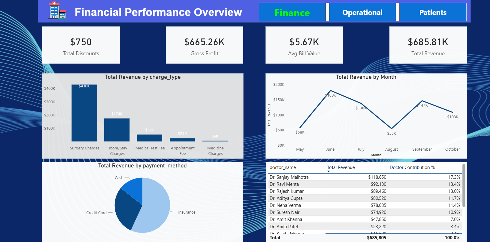
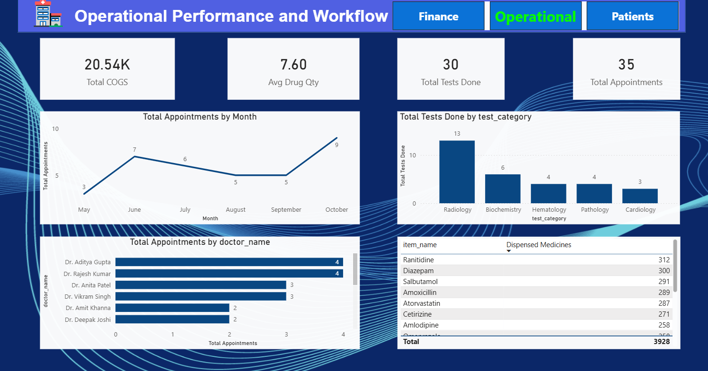

# 🏥 Hospital Performance Strategic Analytics Dashboard

## 📌 Overview

This project provides a complete **Business Intelligence solution** built using **Power BI**, designed to analyze hospital financial performance, operational efficiency, and patient demographics.
The dashboard transforms raw hospital data into **clear, actionable insights** that support strategic decision-making and resource optimization.

---
## 🖥️ Dashboard Preview

### **Finance**

### **Operations Sheet**

### **patients Sheet**

------------------
## 🎯 Project Objectives

The dashboard includes **three major analytical views**, each answering key strategic questions:

### **1. Financial Analysis**

* What are the hospital’s main revenue drivers?
* What is the Gross Profit and Profit Margin?
* Which services generate the highest income?

### **2. Operational Performance**

* What is the overall workload trend (appointments & lab tests)?
* Which resources (Doctors, Labs) are over- or under-utilized?

### **3. Patient Analytics**

* What are the demographics of our patients (age, gender, area)?
* What is the average revenue per patient?
* How do different patient segments behave?

---

## 🛠️ Technical Implementation

### **A. Data Modeling Architecture**

A **Star Schema** was used to ensure clean, efficient filtering and analysis:

* **Fact Tables:**
  `bills`, `appointments_fact`, `patient_tests_fact`
* **Dimension Table:**
  `patient_info`

This structure ensures fast performance and consistent cross-dashboard filtering.

---

### **B. Key DAX Measures**

More than **10 KPIs** were developed, including:

* `Total Revenue`
* `Gross Profit`
* `Avg Revenue per Patient`
* `Total Appointments`
* `Total Tests`
* Year-To-Date & Same-Period-Last-Year metrics

These measures provide dynamic calculations based on user filters.

---

### **C. Technical Challenges Solved**

| Challenge                        | Solution                                                                     | Why It Matters                                |
| -------------------------------- | ---------------------------------------------------------------------------- | --------------------------------------------- |
| Cross-fact filtering not working | Used **Both-direction relationships** between `patient_info` and fact tables | Enabled filtering across multiple fact tables |
| Incorrect visual interactions    | Cleaned all **Edit Interactions** and validated filter context               | Ensured visuals communicate correctly         |
| Missing patient age groups       | Created **DAX calculated column** using SWITCH                               | Enabled clear demographic segmentation        |

---

## 🚀 How to Use the Project

1. **Download or clone** the repository.
2. Open the `.pbix` file using **Power BI Desktop**.
3. If needed, update database connections via:
   **Home → Transform Data → Data Source Settings**
4. Explore the main report pages:

   * **Finance Dashboard**
   * **Operational Dashboard**
   * **Patient Analytics Dashboard**
5. Use the slicers and visuals to explore insights interactively.

